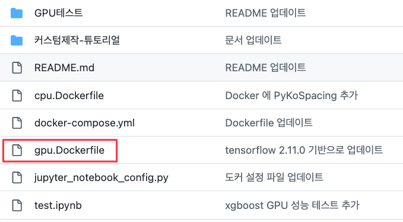

# 커스텀 빌드

### Dockerfile을 수정하여 직접 빌드

커스텀이 가능합니다. 필요한 추가 패키지가 있다면 추가 구성이 가능합니다.

추가 패키지 설치를 위해서는 `gpu.Dockerfile`을 수정하시면 됩니다.


먼저 내가 베이스(base)가 될만 한 도커를 선정하고 이를 클론(Clone)한 뒤 확장해 나가는 방식이 편합니다. 처음부터 작성을 하지 않아도 되기 때문입니다.

`deepko`(https://github.com/teddylee777/deepko.git) 를  클론(clone) 하여 원하는 패키지를 추가하셔도 좋습니다.

```bash
git clone https://github.com/teddylee777/deepko.git
```


클론 후 `gpu.Dockerfile`을 수정하면 됩니다. (원하는 패키지를 추가 하거나, 필요없는 패키지를 제외할 수 있습니다)




**예시) `hyperopt` 설치를 제외하려는 경우**

아래 line 을 지워버리면 됩니다.


반대로 추가하고 싶은 패키지가 있다면 맨 끝에 추가하시면 됩니다. 끝에 추가 할 때 이전 줄의 끝 부분에 `&& \` 붙여주시는 것을 잊지 말아 주세요.


수정이 모두 완료 되었다면, 수정이 완료된 `gpu.Dockerefile`을 빌드합니다.

빌드 타겟은 내가 원하는 이미지(image) 이름을 태그와 함께 지정합니다.


`도커유저명/리포지토리:태그`

아래의 3가지 변수는 **본인의 유저 아이디, 도커명, 태그로 변경**하시면 됩니다.

**(예시)**

- DockerHub 유저 아이디: teddylee777
- 도커명: deepko
- 태그: latest

**옵션**

- `-f`: 빌드시 참고할 도커 파일

- `-t`: 빌드후 생성할 도커 이미지 타겟

```bash
cd deepko
docker build -f gpu.Dockerfile -t teddylee777/deepko:latest .
```

